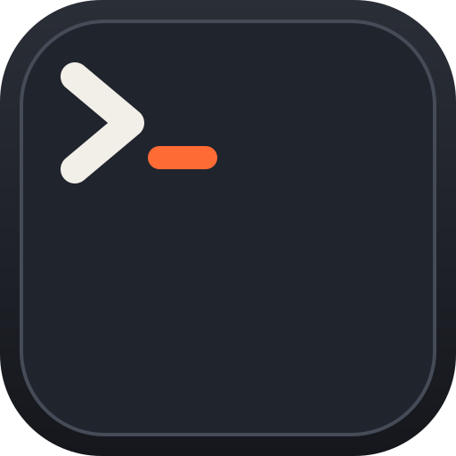

<div align="center">



<h1>tty7</h1>

**The terminal that outlives its window.**

<sub>Pure Rust · GPU rendering on Zed's gpui · VT core from Alacritty</sub>

<br />

[](https://github.com/l0ng-ai/tty7/actions/workflows/ci.yml)
[](https://github.com/l0ng-ai/tty7/releases)
[](https://github.com/l0ng-ai/tty7/releases)
[](LICENSE)

<sub>English · [简体中文](README.zh-CN.md)</sub>

<br />

<a href="assets/tour.mp4"></a>

</div>

<br />

Most terminals tie your shells to a window. Close the window and the shells die
with it. So people run tmux inside their terminal to keep them alive, which
works, but it means learning a second set of keys and keeping a second config
file, just to get around the window.

tty7 takes a simpler approach. The shells belong to a server running in the
background, and the window only shows them. Close the window and nothing happens
to the shells. Most of what's interesting about tty7 follows from that one
decision.

## Quitting doesn't kill anything

Quit tty7 and every shell keeps running. Your build doesn't notice.

A reboot is different. The processes are gone, because that's what a reboot
does. But each pane comes back with its layout and the last of what was on
screen, and supported agents pick up the same conversation where they left off.

You don't need tmux for any of this, and there's nothing to configure.

→ [What survives what](docs/getting-started/concepts.mdx)

## Agents that run agents

A lot of people now run several coding agents at once, in several repos. Which
means spending the day switching between windows to see which one finished and
which one is waiting for an answer. That's not work a person should have to do.

tty7 recognizes 26 coding CLIs, including Claude Code, Codex, Gemini, Cursor,
and OpenCode, and puts all of them in one sidebar: whether each is working or
waiting, a notification when one needs you, and its branch and diff. You can see
at a glance which one wants you.

Once an agent's status is something a program can ask about, the one asking
doesn't have to be you. It can be another agent. The whole loop is four
commands, with no framework, and it works whether or not the GUI is open:

```sh
PANE=$(tty7 split --v)                                       # give the worker a pane
tty7 send "$PANE" 'claude "add tests for the parser"' --enter
tty7 wait "$PANE" --until waiting,done --changed --timeout 600  # until it's done or stuck
tty7 capture "$PANE" --plain                                 # read what happened
```

tty7 doesn't wrap the agents or sit between you and them. The agent you start
is the real one, running in an ordinary PTY. Simple things are more likely to
keep working.

→ [Orchestrating agents](docs/agents/orchestration.mdx) ·
[agent skill](skills/tty7/SKILL.md) · [full support matrix](#supported-agents)

## Remote is the same thing

A remote workspace is the same server, running on the other machine. The window
here just shows it. Tabs, panes, the file tree, git, and diffs all live over
there, and no files get synced. Connect from a different laptop and everything
is where you left it.

So remote isn't really a separate feature. It's the local case with the server
somewhere else.

The SSH client is tty7's own, written in Rust, so it doesn't depend on the
system's ssh. It has profiles with keychain secrets, jump hosts, SFTP, and
automatic port forwarding. The remote `tty7-server` installs once and doesn't
need root.

→ [Remote workspaces](docs/remote/workspaces.mdx)

## Speed

Speed isn't the point of tty7, but it shouldn't be a weakness either, and it
turns out not to be. `cat` on an 11 MB file takes 95 ms; the next fastest
terminal we measured takes 179. DOOM-fire runs at 888 fps; the next best manages
617. The method and scripts are public, and one command reproduces them.

| | **tty7** | Alacritty | Ghostty | Kitty |
|---|---:|---:|---:|---:|
| Plaintext I/O — 11 MB `cat` <sub>(lower = better)</sub> | **95 ms** | 239 ms | 179 ms | 185 ms |
| [DOOM-fire](https://github.com/const-void/DOOM-fire-zig) frame rate <sub>(higher = better)</sub> | **888 fps** | 485 fps | 552 fps | 617 fps |
| Cold-launch memory | 116 MB¹ | 105 MB | 128 MB | 130 MB |

<sub>Apple M1 Pro, macOS 26.3.1, 155×40 grid, five-run averages, 2026-07-04. ¹ GUI 105 MB + the persistent server 11 MB.
Methodology and one-command reproduction: [`scripts/bench/`](scripts/bench/README.md).</sub>

## Everything else

The rest is details, but details are most of what makes a tool pleasant to use.
The prompt has suggestions from your history, tab completion that explains each
option, syntax highlighting, and real multi-line editing, and <kbd>⌃ R</kbd>
searches your history. <kbd>⌘ P</kbd> searches everything. <kbd>⌘ J</kbd> opens
a side panel with processes, ports, files, changes, and GitHub issues and PRs.
Shell integration works in zsh, bash, fish, PowerShell, and WSL without
installing anything.

→ [Full documentation](docs/) · [keyboard shortcuts](docs/reference/keyboard-shortcuts.mdx) ·
[config.json](docs/reference/configuration.mdx) · [CLI reference](docs/cli/reference.mdx)

## Install

Native builds on [**Releases**](https://github.com/l0ng-ai/tty7/releases/latest):

| | |
|---|---|
| **macOS** | `.dmg` for Apple silicon or Intel — drag into Applications |
| **Windows** | `-setup.exe`, or the portable `.zip` |
| **Linux** | `.AppImage` — `chmod +x` and run; X11/Wayland libraries bundled |

Give your agents the CLI skill:

```sh
npx skills add l0ng-ai/tty7    # install
npx skills update tty7         # update later
```

## Supported agents

**Detection** is free: brand avatar, branch + diff, tab title.
**Status** takes one click under Settings → Integrations to install that agent's hook,
and brings the status dot, notifications, the tray icon, `tty7 wait`, and resume
after a reboot. **Fork** needs both — the agent's own fork command, and the hook
that tells tty7 which session to fork. **Past sessions** are read from the agent's
own history files and listed in Search Everywhere, where <kbd>⏎</kbd> resumes one.

<details>
<summary>The full support matrix</summary>

| Agent | Detected | Status · resume | Fork | Past sessions |
|---|:-:|:-:|:-:|:-:|
| **Claude Code** | ✓ | ✓ | ✓ | ✓ |
| **Codex** | ✓ | ✓ | ✓ | ✓ |
| **TraeCode** | ✓ | ✓ | ✓ | |
| **Grok** | ✓ | ✓ | ✓ | |
| **OpenCode** | ✓ | ✓ | ✓ | ✓ |
| **Oh My Pi** | ✓ | ✓ | ✓ | ✓ |
| **Prime Agent** | ✓ | ✓ | ✓ | |
| **Droid** | ✓ | ✓ | ✓ | ✓ |
| **Qwen Code** | ✓ | ✓ | ✓ | ✓ |
| **Goose** | ✓ | ✓ | ✓ | |
| **Qoder CLI** | ✓ | ✓ | ✓ | ✓ |
| **Qoder CN CLI** | ✓ | ✓ | ✓ | ✓ |
| **CodeBuddy** | ✓ | ✓ | ✓ | ✓ |
| **Gemini** | ✓ | ✓ | | ✓ |
| **Copilot** | ✓ | ✓ | | ✓ |
| **Kimi Code** | ✓ | ✓ | | ✓ |
| **Pi** | ✓ | ✓ | | ✓ |
| **Crush** | ✓ | ✓ | | |
| **Antigravity** | ✓ | ✓ | | |
| **Cursor** | ✓ | ✓ | | ✓ |
| Aider | ✓ | | | |
| Amp | ✓ | | | |
| Auggie | ✓ | | | |
| Hermes | ✓ | | | |
| Vibe | ✓ | | | |
| Empryo | ✓ | | | |

</details>

---

<div align="center">
<sub>

Built on [gpui](https://github.com/zed-industries/zed) and [`alacritty_terminal`](https://github.com/zed-industries/alacritty) · [Apache-2.0](LICENSE) · [Discord](https://discord.gg/s3dethqz2V) · [Changelog](CHANGELOG.md)

</sub>
</div>
